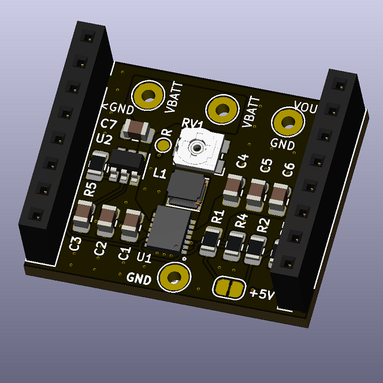
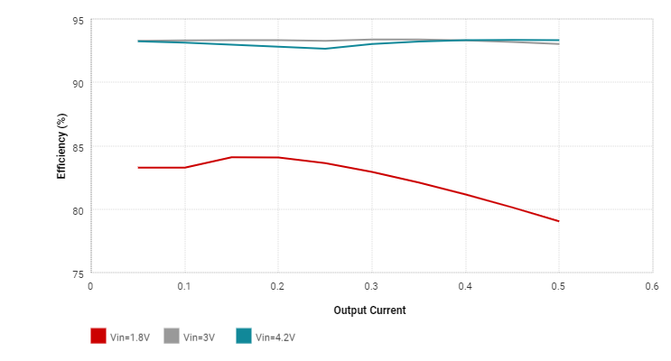
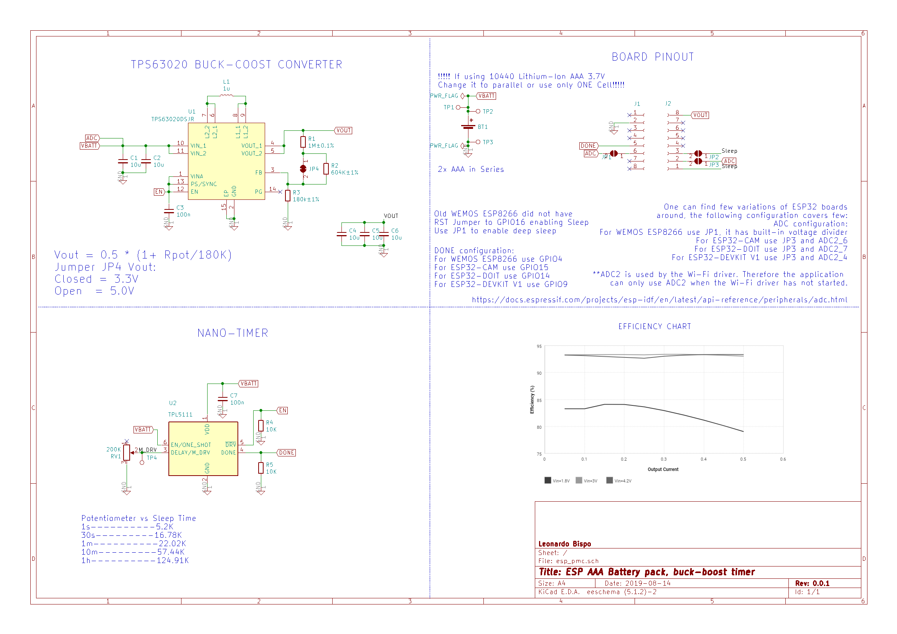

# ESP-battery-pmb

ESP32, ESP8266 and the likes Battery Management Board, Power your device with a single Battery or 2xAAA. With a buit-in Boost and Buck converter + Nano Timer - Sleep Current < 1uA.

## TODO

- [ ] More details about battery etc...

## Efficiency

 

## Schematic

 

## Enclosure

 

## BOM

[ESP Battery pmb](./KiCad/BOM.csv)

## Final Thoughts or Improvements

* 

## Credits

GitHub Shields and Badges created with [Shields.io](https://github.com/badges/shields/)
